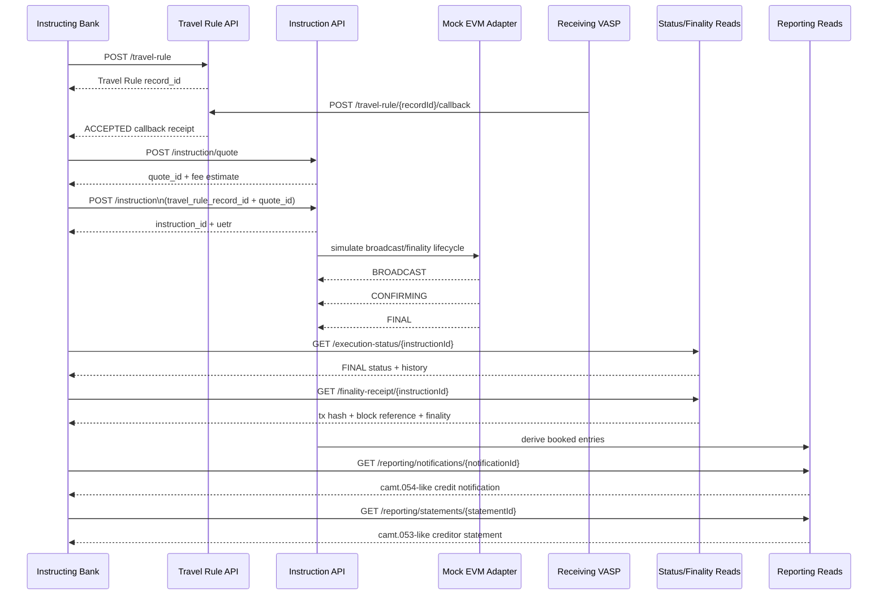

# Bank-to-VASP Demo

This is the reviewer-facing demo for the current `pacs.crypto` execution wedge.

The repo now supports two demo modes:

- `mock demo` for fast local walkthroughs
- `real-chain Sepolia + USDC demo` for reviewer evidence capture

It is intentionally narrow:

- one asset: `USDC`
- one chain family: `EVM`
- one custody model: `FULL_CUSTODY`
- one corridor: `bank -> sending VASP -> on-chain transfer -> receiving VASP`

## Why This Demo

This is the shortest path to showing that the repo is no longer just a
standards proposal.

The demo proves that the stack now supports:

- Travel Rule submission and beneficiary-side callback
- pre-execution quote and instruction submission
- lifecycle progression through `PENDING -> BROADCAST -> CONFIRMING -> FINAL`
- pacs.002-like status and camt.025-like finality reads
- booked reporting outputs derived from the same payment

## Reviewer Outcome

By the end of this walkthrough, a reviewer should be able to see:

- `pacs.008`-shaped business data survives end to end
- blockchain lifecycle concerns are not stuffed into one oversized instruction response
- polling, webhook/eventing, and reporting all reuse the same identifiers
- the project has moved from mock UI/spec prose into an executable reference stack

## Sequence



## Live Walkthrough

### 1. Start the reference server

```bash
cd reference-server
npm install
npm start
```

### 2. Open the simulators

Open these files locally and switch both to `Live API` mode:

- `travel-rule-simulator-v3.html`
- `instruction-simulator-v1.html`

Keep the base URL at `http://127.0.0.1:5050`.

### 3. Show the Travel Rule handshake

Use the Travel Rule simulator to show:

- a `POST /travel-rule` submission
- an `ACCEPTED` callback on the same `record_id`

The point to emphasize:

- the Travel Rule record is a linked compliance context
- it is not being duplicated into every later surface

### 4. Show the instruction path

Use the Instruction simulator to show:

- `POST /instruction/quote`
- `POST /instruction`
- `GET /execution-status/{instructionId}`
- `GET /finality-receipt/{instructionId}`

The point to emphasize:

- the instruction surface remains the command layer
- lifecycle and final settlement proof are exposed through separate reads

### 5. Show booked reporting

Still in the Instruction simulator live view, show:

- the creditor-side booked notification
- the creditor-side statement
- traceability links back to instruction, finality, and Travel Rule objects

The point to emphasize:

- reporting is institution-facing booked-entry reporting, not a block explorer

## Real-Chain Run

Use this path when you want one reviewer-grade Sepolia proof bundle rather than
the default mock-backed walkthrough.

### 1. Preflight the wallet

```bash
cd reference-server
npm run preflight:sepolia
```

This verifies:

- the configured RPC is actually Sepolia
- the private key and configured source address match
- the configured USDC contract has code
- the source wallet has ETH for gas and enough USDC for `REF_SERVER_DEMO_AMOUNT`
  (default `1.00`)

### 2. Start the server in broadcast mode

```bash
REF_SERVER_CHAIN_ADAPTER=sepolia-usdc \
REF_SERVER_SEPOLIA_BROADCAST_ENABLED=true \
npm start
```

### 3. Run the canonical funded-wallet demo

```bash
REF_SERVER_DEMO_RECIPIENT_WALLET=0x... \
REF_SERVER_DEMO_DEBTOR_WALLET="$REF_SERVER_SEPOLIA_SOURCE_ADDRESS" \
npm run demo:sepolia
```

The runner writes a complete evidence bundle under:

- `reference-server/data/demo-runs/<run-id>/`

The runner exits non-zero unless the captured execution status and finality
receipt are both `FINAL`.

To turn that bundle into a reviewer-ready one-pager:

```bash
cd reference-server
npm run demo:report -- data/demo-runs/<run-id>
```

That writes:

- `reference-server/data/demo-runs/<run-id>/21-reviewer-summary.md`

The bundle includes:

- Travel Rule submission and callback
- quote and instruction payloads
- execution-status poll history
- finality receipt
- reporting notifications and statements
- report search and stats views
- summary JSON with tx hash and Sepolia Etherscan URL
- reviewer markdown summary keyed to the same evidence files

Use that bundle as the basis for the Tom-facing walkthrough once one clean run
has been captured.

## Sample Payload Pack

The exact happy-path payload set used for this demo is under
[`docs/demo-samples/happy-path/`](demo-samples/happy-path/).

Recommended review order:

1. [01-travel-rule-submit.request.json](</Users/Raafet/Projects/codex_test/PACS_CRYPTO/docs/demo-samples/happy-path/01-travel-rule-submit.request.json>)
2. [02-travel-rule-submit.response.json](</Users/Raafet/Projects/codex_test/PACS_CRYPTO/docs/demo-samples/happy-path/02-travel-rule-submit.response.json>)
3. [03-travel-rule-callback.request.json](</Users/Raafet/Projects/codex_test/PACS_CRYPTO/docs/demo-samples/happy-path/03-travel-rule-callback.request.json>)
4. [04-travel-rule-callback.response.json](</Users/Raafet/Projects/codex_test/PACS_CRYPTO/docs/demo-samples/happy-path/04-travel-rule-callback.response.json>)
5. [05-instruction-quote.request.json](</Users/Raafet/Projects/codex_test/PACS_CRYPTO/docs/demo-samples/happy-path/05-instruction-quote.request.json>)
6. [06-instruction-quote.response.json](</Users/Raafet/Projects/codex_test/PACS_CRYPTO/docs/demo-samples/happy-path/06-instruction-quote.response.json>)
7. [07-instruction-submit.request.json](</Users/Raafet/Projects/codex_test/PACS_CRYPTO/docs/demo-samples/happy-path/07-instruction-submit.request.json>)
8. [08-instruction-submit.response.json](</Users/Raafet/Projects/codex_test/PACS_CRYPTO/docs/demo-samples/happy-path/08-instruction-submit.response.json>)
9. [09-execution-status.final.response.json](</Users/Raafet/Projects/codex_test/PACS_CRYPTO/docs/demo-samples/happy-path/09-execution-status.final.response.json>)
10. [10-finality-receipt.final.response.json](</Users/Raafet/Projects/codex_test/PACS_CRYPTO/docs/demo-samples/happy-path/10-finality-receipt.final.response.json>)
11. [11-reporting-notification.creditor.response.json](</Users/Raafet/Projects/codex_test/PACS_CRYPTO/docs/demo-samples/happy-path/11-reporting-notification.creditor.response.json>)
12. [12-reporting-statement.creditor.response.json](</Users/Raafet/Projects/codex_test/PACS_CRYPTO/docs/demo-samples/happy-path/12-reporting-statement.creditor.response.json>)

## What To Say

Use these points, in roughly this order:

- This repo started as a spec-first proposal and now has an executable reference stack behind the proposal.
- The implementation stays narrow on purpose: `USDC + one EVM family + full custody`.
- The instruction API is no longer overloaded with every downstream concern.
- Status, finality, webhooks, and reporting are separate but linked surfaces.
- The message-family discipline is the point: `pacs.008` is the commercial anchor, not the only object in the system.

## What Not To Claim

Do not overstate the current wedge.

Still intentionally out of scope:

- delegated signing
- non-EVM chains
- production-chain execution
- deeper exception workflow beyond the first-slice investigation/return APIs
- tokenized assets, CBDC, or DeFi expansion
