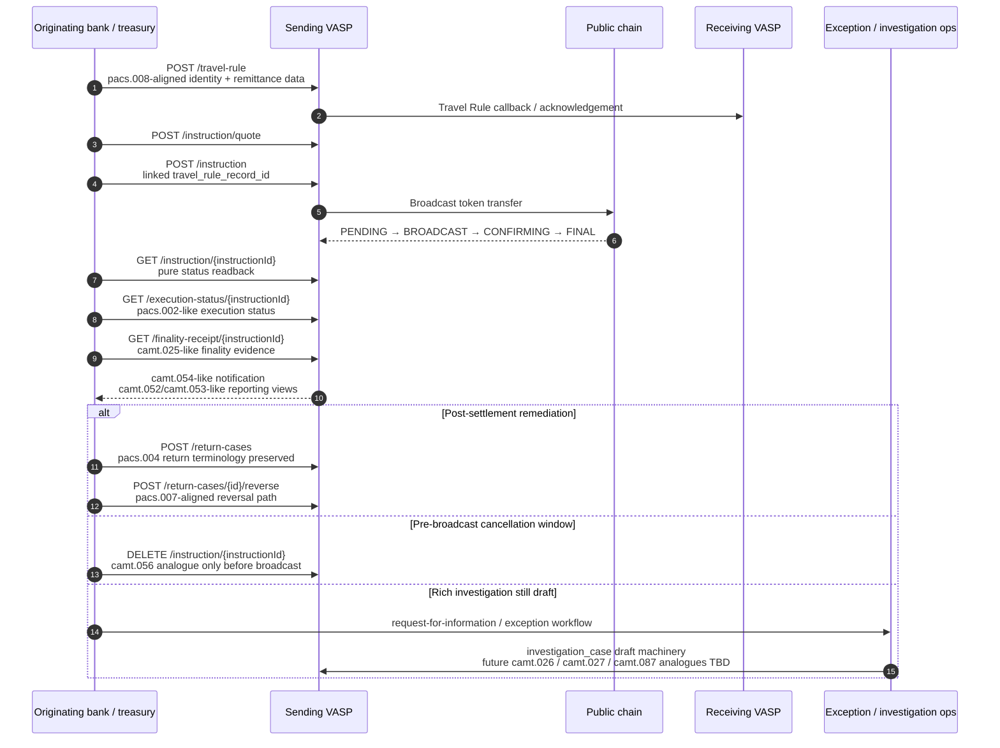
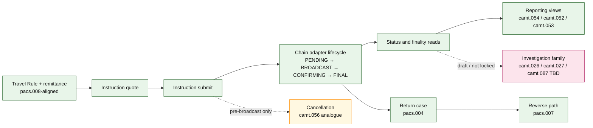

# Visual flow map

This note gives reviewers a visual entry point into the current `pacs.crypto` reference stack. It is intentionally descriptive rather than normative: the implemented reference server is concrete, while the richer investigation family remains draft until the spec design catches up.

## Reviewer questions this map answers

- Where do the Travel Rule record, payment instruction, status reads, finality evidence, returns, reversals, and investigation paths sit in one lifecycle?
- Which parts are already implemented in the reference server?
- Which ISO 20022 analogues are being preserved by name because they are recognised industry vocabulary?
- Which parts are deliberately parked as draft input for future spec work?

## Main lifecycle

## Flow ownership map

## Alignment notes

| Area | Current posture | Why |
| --- | --- | --- |
| Reverse / return terminology | Preserve `pacs.004` and `pacs.007` wording | These names are recognised industry vocabulary and help reviewers understand the intent quickly. |
| `/reverse` | Keep `pacs.007` aligned | Post-settlement remediation is the realistic blockchain case once a public-chain transfer is final. |
| `camt.056` | Treat as pre-broadcast cancellation only | On a public chain, the cancellation window after broadcast is essentially zero. |
| Pure status request | Use `GET /instruction/{instructionId}` | A dedicated richer status-request path is not needed for simple readback. |
| Exception / investigation family | Keep as reference-server draft machinery | Useful concrete input, but the future spec shape should stay open until the design is clearer. |

## Suggested reviewer use

1. Open [`../index.html`](../index.html) for the visual console.
2. Use the inline lifecycle map to orient the discussion.
3. Use this note when reviewing the draft exception-family machinery, especially the boundary between implemented reference behaviour and future spec design.
